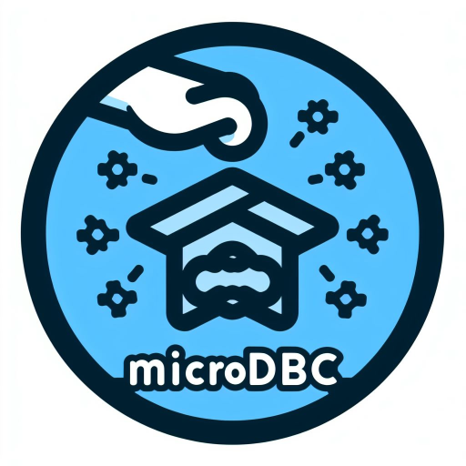

### Kurulum
  * Kurulum çok basit! Sadece proje içerisindeki başlık dosyasını ve kaynak kod dosyasını projenize dahil etmeniz gerekmektedir.

### Gereksinimler
  * Microsoft ODBC Server for SQL 17.0 veya üzeri

### ÖNEMLİ!!!
  * Kodlar sadece Visual C++ derleyicisinde çalışmaktadır.
